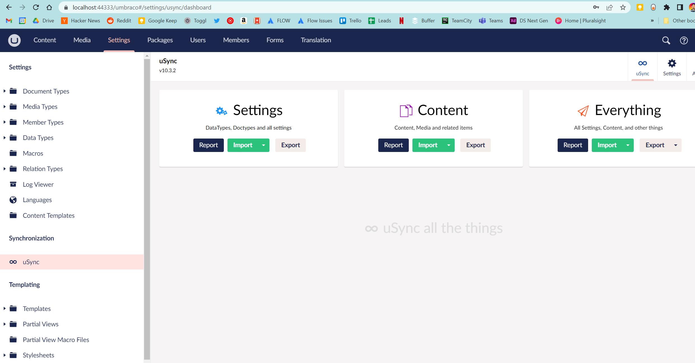

# uSync-membership-test

Sample project to test the issue with membership. Set up using the following steps:

    # Ensure we have the latest Umbraco templates
    dotnet new -i Umbraco.Templates::10.4.0

    # Create solution/project
    dotnet new umbraco --force -n "MyProject" --friendly-name "Administrator" --email "admin@test.com" --password "Pa55word!!" --development-database-type LocalDB

    #Add starter kit and uSync
    dotnet add "MyProject" package uSync --version 10.3.2
    dotnet add "MyProject" package clean
        
    # Run the site
    dotnet run --project "MyProject"

Log in to Umbraco and ensure uSync is running. You should see something like :

    
## Steps to replicate

Add the Cookie auth middleware in a new class. This is based on a comment from the [following forum post](https://our.umbraco.com/forum/using-umbraco-and-getting-started/109692-cookieauthentication-not-working-in-website#comment-341398).

    public static class UmbracoMemberBuilderExtensions
    {
        public static IUmbracoBuilder AddUserCookieAuthentication(this IUmbracoBuilder builder, string cookieName)
        {
            builder.AddMemberExternalLogins(logins =>
            {
                logins.AddMemberLogin(
                    memberAuthenticationBuilder =>
                    {
                        string strSchemeName = CookieAuthenticationDefaults.AuthenticationScheme;

                        memberAuthenticationBuilder.AddCookie(strSchemeName, objCookieAuthenticationOptions =>
                        {
                            objCookieAuthenticationOptions.Cookie.Name = cookieName;
                            // v10 : Add auth login path to config
                            objCookieAuthenticationOptions.LoginPath = "/login/";
                        });

                        builder.Services.AddAuthentication(options =>
                        {
                            options.DefaultAuthenticateScheme = strSchemeName;
                        });
                        builder.Services.AddAuthorization();
                    });
            });
            return builder;
        }
    }

Modify the startup.cs to add Cookie authentication to the build pipeline.

    /// 

    /// Configures the services.
    /// 

    /// <param name="services">The services.</param>
    /// <remarks>
    /// This method gets called by the runtime. Use this method to add services to the container.
    /// For more information on how to configure your application, visit https://go.microsoft.com/fwlink/?LinkID=398940.
    /// </remarks>
    public void ConfigureServices(IServiceCollection services)
    {
        services.AddUmbraco(_env, _config)
            .AddBackOffice()
            .AddWebsite()
            .AddComposers()
            .AddUserCookieAuthentication("MyCookeName")
            .Build();
    }

    /// 

    /// Configures the application.
    /// 

    /// <param name="app">The application builder.</param>
    /// <param name="env">The web hosting environment.</param>
    public void Configure(IApplicationBuilder app, IWebHostEnvironment env)
    {
        if (env.IsDevelopment())
        {
            app.UseDeveloperExceptionPage();
        }

        app.UseUmbraco()
            .WithMiddleware(u =>
            {
                u.UseBackOffice();
                u.UseWebsite();

                
                u.AppBuilder.UseAuthentication();
                u.AppBuilder.UseAuthorization();
            })
            .WithEndpoints(u =>
            {
                u.UseInstallerEndpoints();
                u.UseBackOfficeEndpoints();
                u.UseWebsiteEndpoints();
            });
    }

Run the site and log in to the back office. You should see the following error:

Note : I've not included the implementation of the actual cookie auth, which DOES work as expected. I can if it will help, but in our case we use it to build membership from a different user store.

